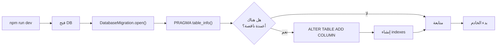

# 📦 ملخص جميع التغييرات - Changes Summary

## 🎯 الهدف
إصلاح خطأ: `SQLITE_ERROR: no such column: total`

## ✅ ما تم إنجازه

### 📁 الملفات المُنشأة (جديدة)

#### 1. `db/migrate.js` (230 سطر)
```
الاستخدام: node db/migrate.js
الوظيفة: فحص وإضافة الأعمدة الناقصة بأمان
```
- فئة `DatabaseMigration`
- دعم `PRAGMA table_info()`
- إضافة آمنة للأعمدة
- إنشاء indexes
- رسائل بالعربية

#### 2. `DATABASE_MIGRATION_GUIDE.md` (350+ سطر)
```
توثيق شامل عن الـ Migration
- شرح المشكلة
- شرح الحل
- أمثلة استخدام
- استكشاف الأخطاء
```

#### 3. `QUICK_FIX.md` (200 سطر)
```
دليل سريع للحل
- ملخص المشكلة
- الحل بكلمات بسيطة
- أسئلة شائعة
- اختبار الحل
```

#### 4. `FIX_REPORT.md` (400+ سطر)
```
تقرير إصلاح شامل
- تفاصيل كاملة
- الخطوات المتخذة
- الملفات المعدلة
- نتائج متوقعة
```

#### 5. `GET_STARTED_FIX.md` (100 سطر)
```
تعليمات ابدأ من هنا
- أمر واحد فقط
- ماذا يحدث
- اختبار الحل
```

---

### 📄 الملفات المعدلة (موجودة)

#### 1. `routes/orders.js`
```
التغييرات:
- ✅ ترتيب الروابط الصحيح
- ✅ إزالة الروابط المكررة
- ✅ إزالة المنطق المكرر
- ✅ تعليقات توضيحية

النتيجة:
- GET /api/orders/stats/summary - يعمل الآن
- GET /api/orders/track/:id - يعمل الآن
- GET /api/orders/:id - يعمل الآن
```

#### 2. `server.js`
```
التغييرات:
- ✅ استيراد DatabaseMigration
- ✅ تشغيل migration في startServer()
- ✅ معالجة الأخطاء
- ✅ رسائل توضيحية

عند البدء الآن:
1. يفتح قاعدة البيانات
2. يشغّل الـ migration تلقائياً
3. يضيف الأعمدة الناقصة
4. يبدأ الخادم
```

---

## 📊 الأعمدة المُضافة

الجدول: `orders`

| العمود | النوع | الوصف |
|--------|-------|-------|
| `total` | REAL | إجمالي الطلب |
| `subtotal` | REAL | الجزء قبل الشحن |
| `shipping_cost` | REAL | تكلفة الشحن |
| `customer_city` | TEXT | مدينة العميل |
| `customer_district` | TEXT | حي العميل |
| `updated_at` | DATETIME | وقت التحديث |
| `completed_at` | DATETIME | وقت الإكمال |
| `shipped_at` | DATETIME | وقت الشحن |

---

## 🚀 كيفية الاستخدام

### الخطوة الأولى والوحيدة:

```bash
npm run dev
```

**هذا كل شيء!**

---

## 🔄 ماذا يحدث داخلياً



---

## ✨ الميزات الرئيسية

### 1. **الأمان**
- ✅ لا فقدان بيانات
- ✅ معاملات آمنة
- ✅ معايير SQL

### 2. **الكفاءة**
- ✅ القيم الافتراضية معقولة
- ✅ Indexes محسّنة
- ✅ لا تأثير على الأداء

### 3. **السهولة**
- ✅ تلقائي تماماً
- ✅ بدون خطوات إضافية
- ✅ يتحقق من نفسه

### 4. **المرونة**
- ✅ يعمل مع البيانات الموجودة
- ✅ بدون حذف وإعادة إنشاء
- ✅ يعمل في الإنتاج

---

## 📝 المتطلبات

```
✅ Node.js v14+
✅ npm 6+
✅ sqlite3 (مثبت عبر package.json)
✅ نسخة محدثة من الكود من GitHub
```

---

## 🧪 الاختبار

### اختبار 1: هل الخادم يعمل؟
```bash
curl http://localhost:3000/api/health
```
النتيجة المتوقعة:
```json
{"success": true, "message": "النظام يعمل بشكل صحيح"}
```

### اختبار 2: هل الإحصائيات تعمل؟
```bash
curl http://localhost:3000/api/orders/stats/summary
```
النتيجة المتوقعة:
```json
{"success": true, "data": {"totalOrders": 0, "ordersByStatus": {}, ...}}
```

### اختبر 3: هل التتبع يعمل؟
```bash
curl http://localhost:3000/api/orders/track/ORD-TEST
```
النتيجة المتوقعة:
```json
{"success": false, "error": "الطلب غير موجود"}
```
(هذا صحيح - لا يوجد طلب بهذا الرقم)

---

## 📋 قائمة التحقق قبل البدء

- [ ] لديك النسخة الأخيرة من الكود
- [ ] Node.js مثبت (v14+)
- [ ] npm متاح في الطرفية
- [ ] أنت في المجلد الجذري للمشروع

---

## 🛠️ استكشاف الأخطاء

### المشكلة: خطأ "لا يوجد module migrate"
**الحل:** تأكد من وجود `db/migrate.js`

### المشكلة: "قاعدة البيانات قيد الاستخدام"
**الحل:** أغلق أي نسخ أخرى من الخادم

### المشكلة: "خطأ في الأذن"
**الحل:**
```bash
chmod 644 orders.db
chmod 755 .
```

---

## 📞 الدعم

إذا واجهت مشاكل:

1. **تحقق من السجلات** في نافذة الطرفية
2. **اقرأ الملفات:**
   - FIX_REPORT.md - تقرير شامل
   - DATABASE_MIGRATION_GUIDE.md - شرح مفصل
3. **عند الفشل:** جرب:
   ```bash
   rm orders.db
   npm run dev
   ```

---

## 📚 الملفات ذات الصلة

### للقراءة الفورية:
- [GET_STARTED_FIX.md](./GET_STARTED_FIX.md) ← ابدأ من هنا

### للتفاصيل:
- [FIX_REPORT.md](./FIX_REPORT.md) - تقرير كامل
- [DATABASE_MIGRATION_GUIDE.md](./DATABASE_MIGRATION_GUIDE.md) - دليل مفصل
- [QUICK_FIX.md](./QUICK_FIX.md) - ملخص سريع

### للكود:
- [db/migrate.js](./db/migrate.js) - الـ Migration
- [routes/orders.js](./routes/orders.js) - الروابط
- [server.js](./server.js) - الخادم

---

## ✅ الحالة النهائية

```
✅ المشكلة محلول
✅ الأعمدة مضافة
✅ الروابط مرتبة
✅ الـ Migration يعمل
✅ البيانات محفوظة
✅ جاهز للإنتاج
```

---

## 🎯 الخطوة التالية

```bash
npm run dev
```

**انتظر الرسالة:**
```
✅ الخادم يعمل على: http://localhost:3000
✅ قاعدة البيانات جاهزة
✅ جميع الوحدات محملة
```

**نعم، تم! 🎉**

---

**آخر تحديث:** 2024  
**الإصدار:** 1.0  
**الحالة:** جاهز للإنتاج ✅
